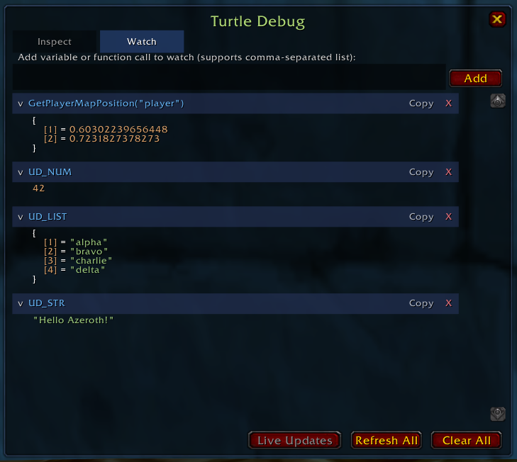

# TurtleDebug

A minimal Lua variable inspector for [Turtle WoW](https://turtle-wow.org/). Inspect any global variable, navigate nested tables with syntax-highlighted output, and keep a watch list of variables you care about.

## Features

- Inspect any global variable or dotted path (e.g. `MyAddon.settings.scale`)
- Watch list with collapsible sections and live updates
- Syntax highlighting by type (strings, numbers, booleans, functions, tables)
- Deep table expansion with circular reference detection
- Copy to clipboard support
- Resizable, draggable window with persistent state
- Zero dependencies — single Lua file, no XML, no libraries

## Commands

| Command | Description |
|---|---|
| `/debug` | Toggle the window |
| `/debug <var>` | Inspect a variable immediately |
| `/debug watch` | Open the Watch tab |
